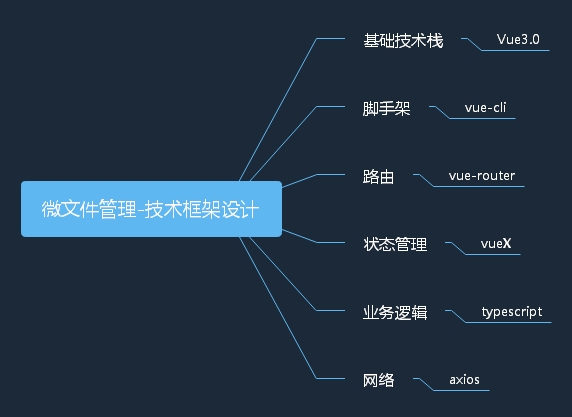
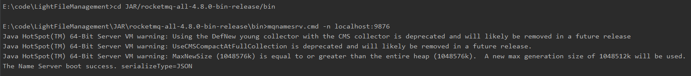
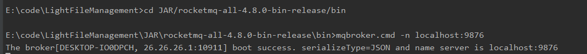
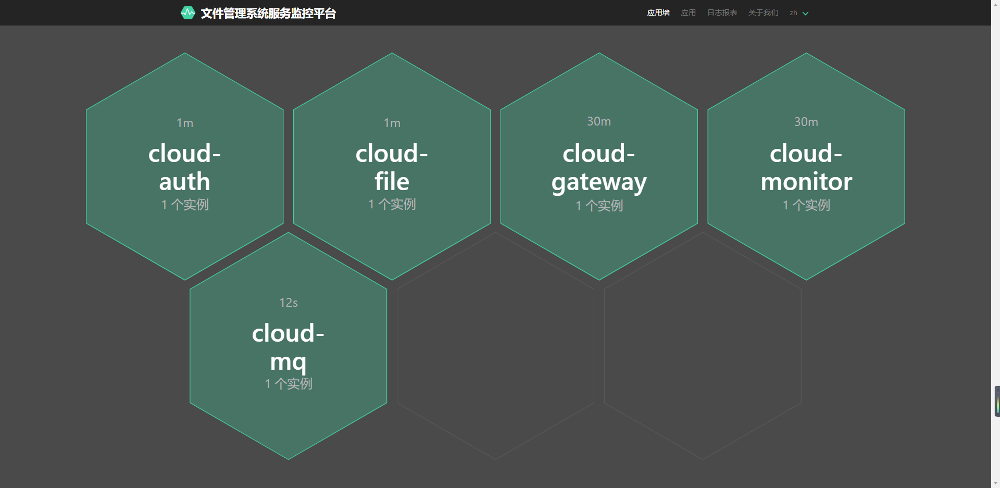
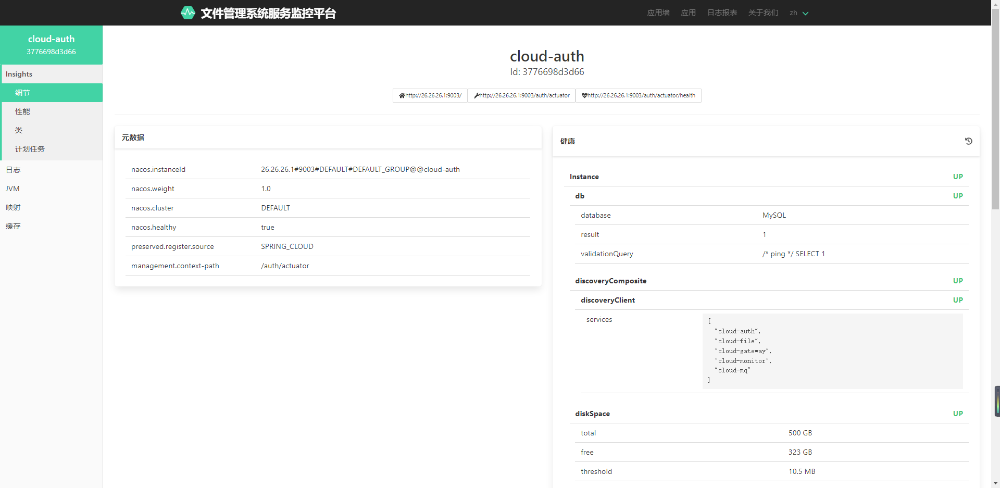
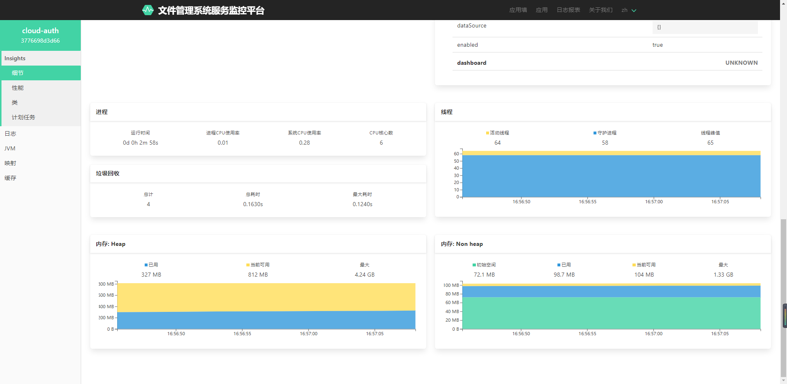

基于cloud alibaba微服务架构的微文件管理系统。

应用到的主要技术栈：Nacos、OpenFeign、Sentinel、Gateway、oauth2、Seata、MySql、Redis、RocketMQ、MyBatis-plus、SpringBoot Admin、线程池

# 整体设计

## 业务框架设计


## 技术框架设计



1、登录以及鉴权系统

1）登录服务放在cloud-auth微服务内，基于Spring-oauth2实现，内部原理还是Spring-security那一套，
核心类是AbstractResponseHandler、CustomAuthenticationProvider、LoginAuthFailHandler、LoginAuthSuccessHandler、LoginOutSuccessHandler
、SecurityConfig

2）鉴权服务放在cloud-gateway微服务内，基于gateway实现，核心类是AuthGlobleFilter，实现了GlobalFilter接口，用filter方法过滤请求

这么设计的目的是为了保证系统提供的接口统一由cloud-gateway进行路由转发，所以在路由之前需要对接口进行过滤，判断其是否可以无需验证就访问，或者是判断其
是否有权限访问服务。保证整个系统在服务提供方面符合迪米特法则，减少前后端之间的直接依赖，只通过gateway进行通信。

## 整体架构图


# 技术框架使用注意事项

## 开发规范
### 接口统一输出标准
```
//com.xrw.springCloudAlibaba.vo.ResponseJSON.java
{
    "errorcode": "错误码",
    "data": "数据体",
    "msg": "错误信息" 
}
```

### 接口文档地址
通过postman生成的在线API文档，地址：https://documenter.getpostman.com/view/6237002/UVJckwet。
这只是个临时的接口文档发布地址，正式使用的时候应该将接口文档发布到专门的接口管理平台上面去。

## 多线程
多线程尽量使用配置好的线程池，本系统采用的是《阿里巴巴Java开发手册》ThreadPoolExecutor，本系统在com.xrw.springCloudAlibaba.bean.MyThreadPoolExecutor
类下创建了按场景分类配置线程池参数的线程池Bean：MyIoThreadPoolExecutor和MyCpuThreadPoolExecutor，分别用于CPU密集型业务和IO密集型业务，
可根据实际的业务分类，每个业务根据实际场景创建自己的线程池！

## 事务
### 一般事务

1、避免长事务：对事务方法进行拆分，尽量让事务变小，变快，减小事务的颗粒度。

注：长事务会导致的问题：

- 数据库连接池被占满，应用无法获取连接资源；（对于@Transactional注解包裹的整个方法都是使用同一个connection连接。如果我们出现了耗时的操作，比如第三方接口调用，
业务逻辑复杂，大批量数据处理等就会导致我们我们占用这个connection的时间会很长，数据库连接一直被占用不释放。一旦类似操作过多，就会导致数据库连接池耗尽。）
- 容易引发数据库死锁；
- 数据库回滚时间长；
- 在主从架构中会导致主从延时变大。

2、在拆分长事务中注意，当调用的@Transactional声明的方法位于同一类中会导致注解失效，原因是因为@Transactional基于SpringAop动态代理实现，同类调用基于this，而不是代理类。
这时可以将方法放入另一个类，如新增manager层，通过spring注入，这样符合了在对象之间调用的条件。

3、对于复杂且无法拆分的业务，或者需要对非数据库数据进行回滚时，使用TransactionTemplate编程式事务替代声明式事务

### 分布式事务
当存在一个请求中，数据在不同的微服务之间传播时，需要用到分布式事务，本系统的分布式事务实现是seata，简单使用@GlobalTransactional注解实现分布式事务。


## Redis
启动Redis服务：进入JAR/Redis-x64-5.0.10目录,运行命令```redis-server ./redis.windows.conf```

使用注解，尽量避免手动代码使用缓存。注解参考例子。主要使用@Cacheable(读缓存如果没有则执行代码)和@CacheEvict(清缓存)， 
如果是明确key的例如user的插入更新，则使用@CachePut(执行代码并将结果放入缓存)和@Cacheable读取缓存  
缓存的时间注意尽量贴合业务场景，对于不会频繁改动的数据可以缓存旧一点  
不同业务的缓存使用不同的缓存空间分开  

举个例子  
在查询实现方法getPlatformList增加@Cacheable(value=RedisAutoCacheValue.PLATFORM_LIST)  
在更新方法(这里举例，后端暂无用到更新缓存的接口)增加@CacheEvict(value=RedisAutoCacheValue.PLATFORM_LIST)  
这样，当代码执行到getPlatformList的时候会产生一个PLATFORM_LIST的自动缓存，当代码执行更新方法的时候会清除PLATFORM_LIST的缓存  

默认缓存是2小时，使用5分钟缓存：@Cacheable(cacheManager = "cacheManagerIn1Minutes",value=RedisAutoCacheValue.PLATFORM_LIST)

需要灵活使用Redis时，使用RedisUtil工具类，放在com.xrw.springCloudAlibaba.utils包下
## Nacos

### 官方文档
  https://nacos.io/zh-cn/docs/what-is-nacos.html


### 单机模式支持mysql
  在0.7版本之前，在单机模式时nacos使用嵌入式数据库实现数据的存储，不方便观察数据存储的基本情况。0.7版本增加了支持mysql数据源能力，具体的操作步骤：

  1.安装数据库，版本要求：5.6.5+

  2.初始化mysql数据库，数据库初始化文件：nacos-mysql.sql

  3.修改conf/application.properties文件，增加支持mysql数据源配置（目前只支持mysql），添加mysql数据源的url、用户名和密码。
  ```yaml
  spring.datasource.platform=mysql
  
  db.num=1
  db.url.0=jdbc:mysql://11.162.196.16:3306/nacos_devtest?characterEncoding=utf8&connectTimeout=1000&socketTimeout=3000&autoReconnect=true
  db.user=nacos_devtest
  db.password=youdontknow
  再以单机模式启动nacos，nacos所有写嵌入式数据库的数据都写到了mysql
  ```
### Nacos启动
  Linux/Unix/Mac：

  sh startup.sh -m standalone.

  Standalone means it is non-cluster Mode. 

  Windows：

  cmd startup.cmd -m standalone.

  Standalone means it is non-cluster Mode. 

## RocketMQ

### 启动RokectMQ服务
首先配置环境变量ROCKETMQ_HOME，值为rocketmq根目录，例如E:\code\LightFileManagement\JAR\rocketmq-all-4.8.0-bin-release

进入JAR/rocketmq-all-4.8.0-bin-release/bin目录，首先运行```mqnamesrv.cmd -n localhost:9876```
启动Name Server,然后运行```mqbroker.cmd -n localhost:9876```启动broker服务，两个服务都启动成功，代表RocketMQ启动成功。



### RocketMQ可视化仪表盘
官方源码地址：https://github.com/apache/rocketmq-dashboard

本项目已经将源代码clone下来并整合到本系统中，修改了后端配置文件cloud-rocketmq-dashboard/src/main/resources/application.properties
里面的server.port=9010和rocketmq.config.namesrvAddr=localhost:9876；还修改了前端配置文件cloud-rocketmq-dashboard/frontend/package.json里面的"proxy": "http://localhost:9010",
 只需要用maven工具进行clean和package操作，然后将生成的jar包启动即可，
也可以使用命令行：
```
mvn clean package -Dmaven.test.skip=true
java -jar target/cloud-rocketmq-dashboard-1.0.1-SNAPSHOT.jar
```
- 生成的Jar包已经放到JAR目录下,可以进入JAR目录，然后运行```java -jar cloud-rocketmq-dashboard-1.0.1-SNAPSHOT.jar```

- cloud-rocketmq-dashboard服务不需要做成微服务发布到注册中心

- 使用localhost:9010访问可视化界面。

## 服务监控平台
本系统具备服务监控的能力，服务监控平台基于SpringBoot Admin搭建，具备GC、线程、内存、日志等的监控能力，搭建好的效果部分截图如下：




# Stats

