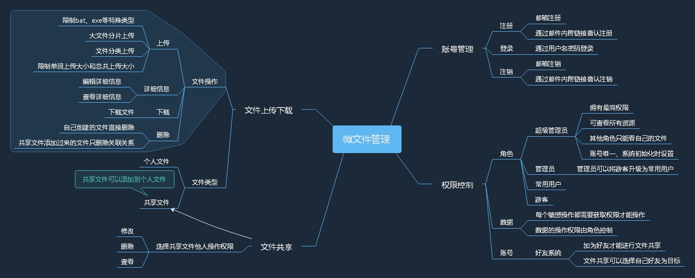
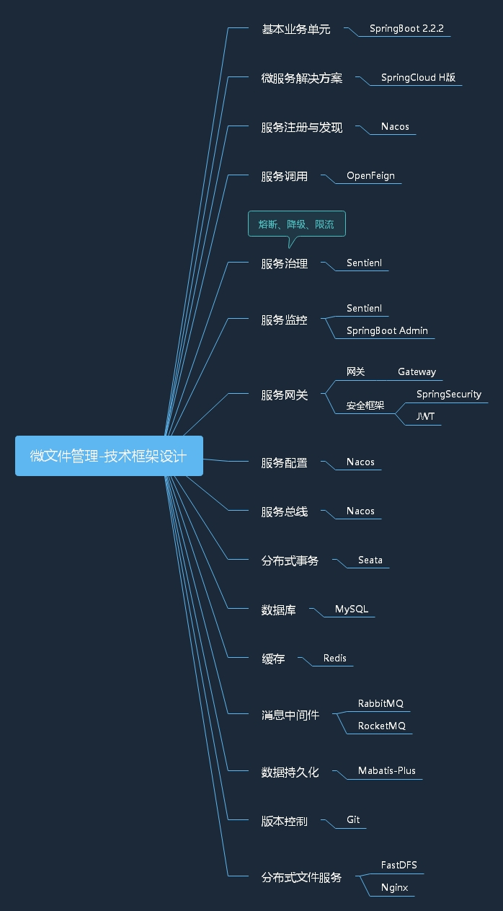
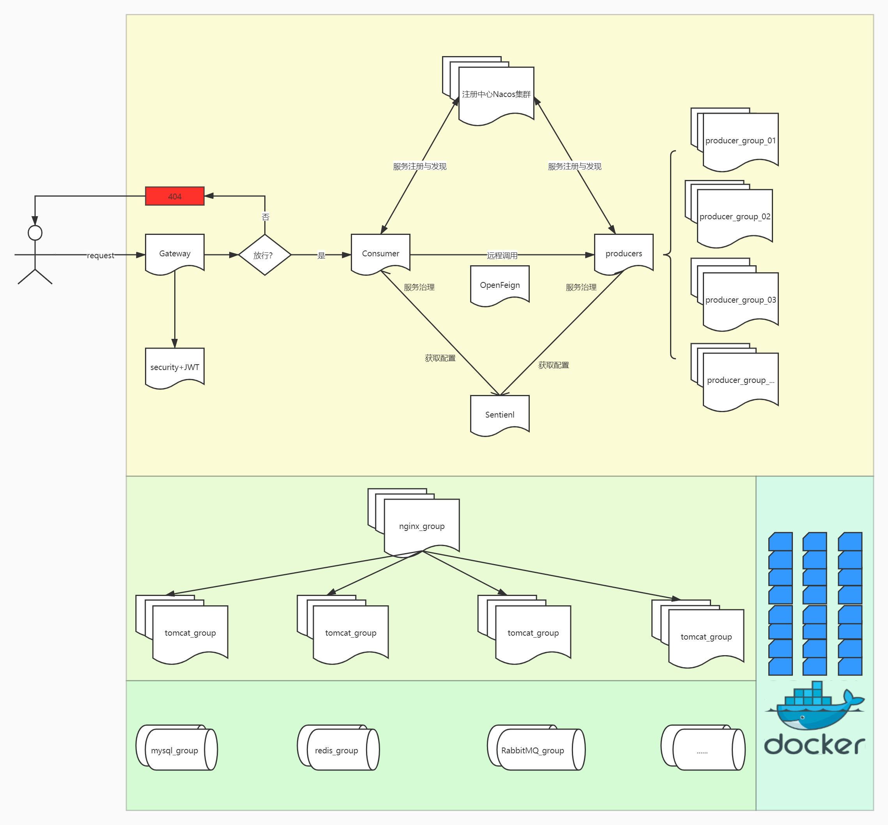

基于cloud alibaba微服务架构的微文件管理系统

# 整体设计

## 业务框架设计


## 技术框架设计


## 整体架构图


# 技术框架使用注意事项

## Redis
启动Redis服务：redis-server ./redis.windows.conf

使用注解，尽量避免手动代码使用缓存。注解参考例子。主要使用@Cacheable(读缓存如果没有则执行代码)和@CacheEvict(清缓存)， 
如果是明确key的例如user的插入更新，则使用@CachePut(执行代码并将结果放入缓存)和@Cacheable读取缓存  
缓存的时间注意尽量贴合业务场景，对于不会频繁改动的数据可以缓存旧一点  
不同业务的缓存使用不同的缓存空间分开  

举个例子  
在查询实现方法getPlatformList增加@Cacheable(value=RedisAutoCacheValue.PLATFORM_LIST)  
在更新方法(这里举例，后端暂无用到更新缓存的接口)增加@CacheEvict(value=RedisAutoCacheValue.PLATFORM_LIST)  
这样，当代码执行到getPlatformList的时候会产生一个PLATFORM_LIST的自动缓存，当代码执行更新方法的时候会清除PLATFORM_LIST的缓存  

默认缓存是2小时，使用5分钟缓存：@Cacheable(cacheManager = "cacheManagerIn1Minutes",value=RedisAutoCacheValue.PLATFORM_LIST)

# Nacos使用说明

## 官方文档
  https://nacos.io/zh-cn/docs/what-is-nacos.html


## 单机模式支持mysql
  在0.7版本之前，在单机模式时nacos使用嵌入式数据库实现数据的存储，不方便观察数据存储的基本情况。0.7版本增加了支持mysql数据源能力，具体的操作步骤：
  
  1.安装数据库，版本要求：5.6.5+
  
  2.初始化mysql数据库，数据库初始化文件：nacos-mysql.sql
  
  3.修改conf/application.properties文件，增加支持mysql数据源配置（目前只支持mysql），添加mysql数据源的url、用户名和密码。
  ```yaml
  spring.datasource.platform=mysql
  
  db.num=1
  db.url.0=jdbc:mysql://11.162.196.16:3306/nacos_devtest?characterEncoding=utf8&connectTimeout=1000&socketTimeout=3000&autoReconnect=true
  db.user=nacos_devtest
  db.password=youdontknow
  再以单机模式启动nacos，nacos所有写嵌入式数据库的数据都写到了mysql
  ```
## Nacos启动
  Linux/Unix/Mac：
  
  sh startup.sh -m standalone.
  
  Standalone means it is non-cluster Mode. 
  
  Windows：
  
  cmd startup.cmd -m standalone.
  
  Standalone means it is non-cluster Mode. 
  
