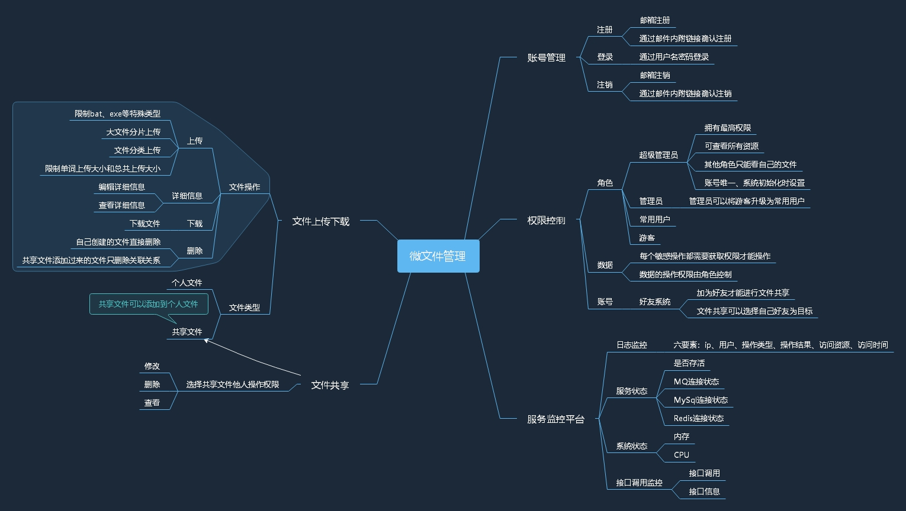

基于cloud alibaba微服务架构的微文件管理系统

# 整体设计

## 业务框架设计

## 技术框架设计

## 整体架构图

# 技术框架使用注意事项

## Redis
启动Redis服务：redis-server ./redis.windows.conf

使用注解，尽量避免手动代码使用缓存。注解参考例子。主要使用@Cacheable(读缓存如果没有则执行代码)和@CacheEvict(清缓存)， 
如果是明确key的例如user的插入更新，则使用@CachePut(执行代码并将结果放入缓存)和@Cacheable读取缓存  
缓存的时间注意尽量贴合业务场景，对于不会频繁改动的数据可以缓存旧一点  
不同业务的缓存使用不同的缓存空间分开  

举个例子  
在查询实现方法getPlatformList增加@Cacheable(value=RedisAutoCacheValue.PLATFORM_LIST)  
在更新方法(这里举例，后端暂无用到更新缓存的接口)增加@CacheEvict(value=RedisAutoCacheValue.PLATFORM_LIST)  
这样，当代码执行到getPlatformList的时候会产生一个PLATFORM_LIST的自动缓存，当代码执行更新方法的时候会清除PLATFORM_LIST的缓存  

默认缓存是2小时，使用5分钟缓存：@Cacheable(cacheManager = "cacheManagerIn1Minutes",value=RedisAutoCacheValue.PLATFORM_LIST)

